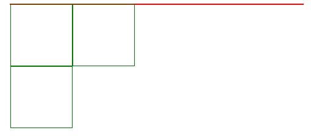
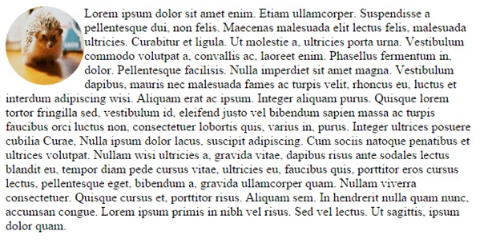
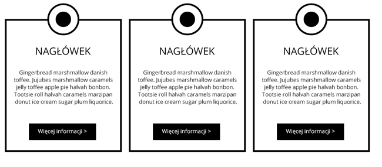

# CSS &ndash; pozycjonowanie elementów

## Zadanie 1
Stwórz dwa elementy **div**, ustaw je po obu stronach okna przeglądarki.

## Zadanie 2
Stwórz element **div**, ustaw mu szerokość ```800px``` oraz ```border: 1px solid red```.
Do tego elementu wklej **divy** z poprzedniego zadania. Zobacz, jak tym razem ustawione zostały te elementy.

## Zadanie 3
Elementy **div** z poprzedniego zadania ustaw obok siebie za pomocą **float**. Dodaj trzeci **div**. Za pomocą **clear** przesuń ostatni **div** na dół.



## Zadanie 4
Stwórz listę ```ul``` z pięcioma elementami (np. jakieś menu). Ustaw jego elementy obok siebie za pomocą **float**.

## Zadanie 5
Ustaw obrazek w taki sposób jak pokazano niżej. Obrazek znajdziesz w katalogu **images**. Nazwa pliku ```jez.jpg```.



## Zadanie 6
Obrazek z poprzedniego zadania przesuń według schematu poniżej:


## Zadanie 7
Stwórz w osobnym elemencie **div** dwa obrazki (mogą być takie same). Ustaw im właściwości **z-index** tak jak poniżej.


## Zadanie 8
Stwórz następujący układ:


## Zadanie 9
Stwórz następujący układ:


